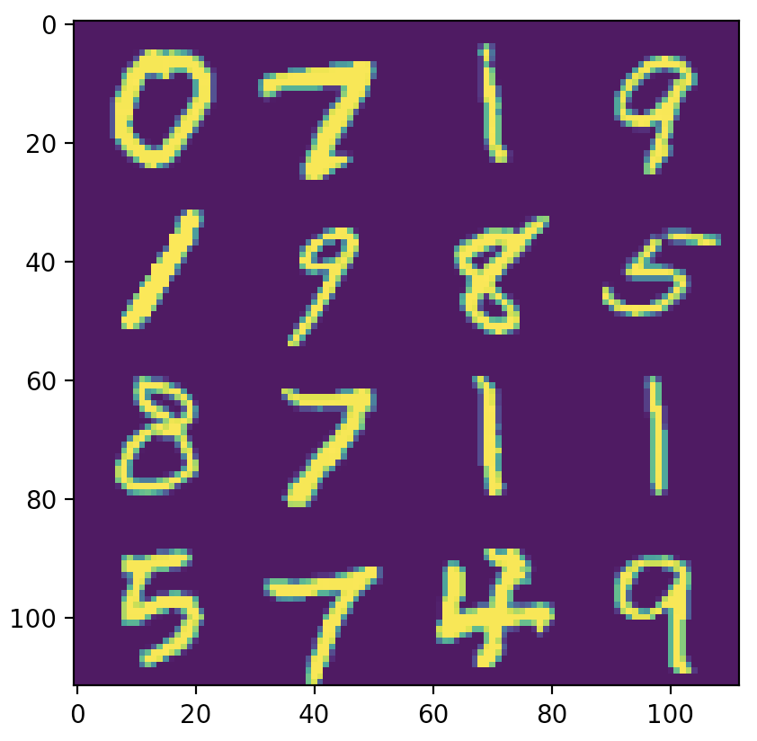
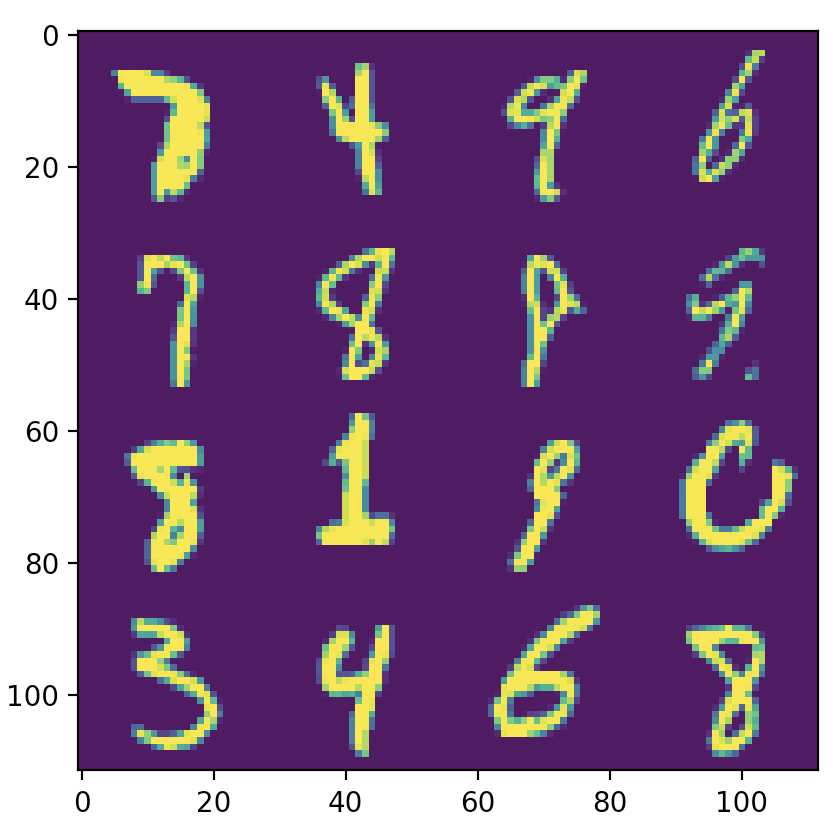

# evilsplit

Trying to find the MNIST train/test split that breaks things the most!

# Technique

First, a small single-layer network is trained on all 70K MNIST samples. Samples are then sorted by their cross-entropy loss from the trained network. The test set is selected by picking the worst (highest loss) 1K samples from each class.

# Results

On the adversarial split, the single-layer MLP gets 81% test accuracy. This is much worse than the 97% accuracy it gets on the standard split.

On the adversarial split, a two-layer CNN architecture gets 87% test accuracy. The same model gets 99% accuracy on the standard split.

Sample of adversarial training set. They look pretty clean and clearly-identifiable.

Sample of adversarial test set. Lots of messed up digits, weird dots, etc.

